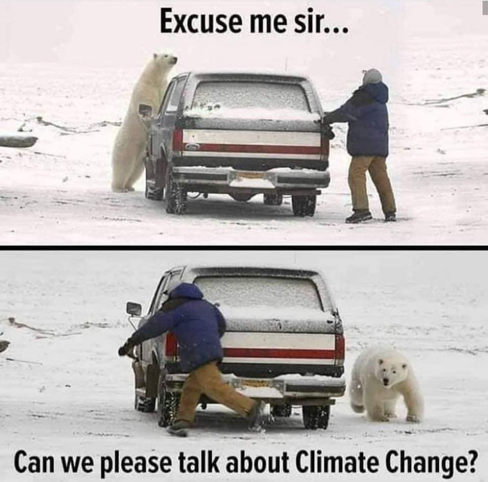
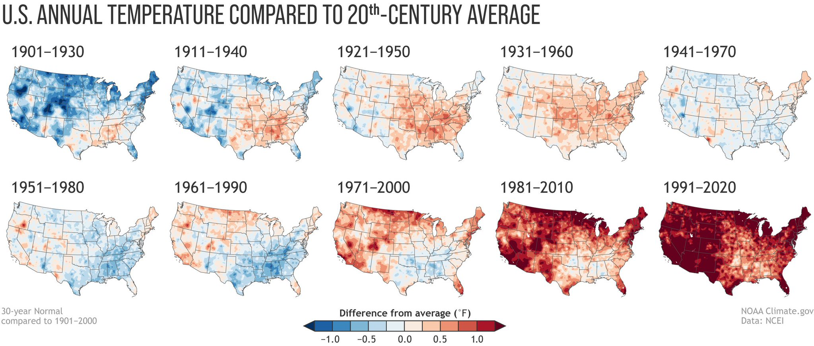
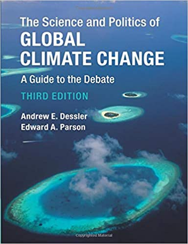

  
```{r setup, include=FALSE}
knitr::opts_chunk$set(warning = FALSE, message = FALSE, 
                      fig.retina = 3, fig.align = "center")
```

```{r xaringanExtra, echo=FALSE}
xaringanExtra::use_webcam()
```

.pull-left[
# Course Introduction and Overview
<figure>
  
</figure>
]

.pull-right[

</br>
</br>
</br>
**POLI 102: Contemporary Political Issues: _Climate Change_ **

**Summer 2021**

.light[Matthew Nowlin, PhD<br>
Department of Political Science<br>
College of Charleston
]

]

---

class: title title-1

# The Syllabus 

**It's on OAKS (lms.cofc.edu)** 

**Content -> Course Information -> POLI 102 Syllabus** 

**Provides overview of course and includes required materials and assignments** 

**Specific required readings for each module will be list on OAKS** 

---

class: title title-1

# Your Professor 

.pull-left[
<figure>
  
</figure>
]

.pull-right[
- Dr. Matthew C. Nowlin 

- Email: [nowlinmc@cofc.edu](mailto:nowlinmc@cofc.edu)

- Meetings: Use the [Calendly link](https://calendly.com/nowlinmc/meetings) on the syllabus and on OAKS  

- **Public Policy Concentration** 

- **Environmental Policy Research Group** 
]


---

class: title title-1

# Contemporary Political Issues 

.pull-left[
## What is this course about? 

_An introductory course for majors and non-majors that emphasizes the analysis of current domestic and international issues. Issues covered will vary from semester to semester._ 
]

.pull-right[
<figure>
  
</figure>
]

---

class: title title-1

# Climate Change 

.pull-left[
We will use the issue of climate
change to examine:  
* The process of addressing complex problems
* The interplay of science and politics 
* The development of public policy 
]

.pull-right[
</br>
</br>
<figure>
<center>
  
</figure>
]

---

class: title title-1

# Course Information 

**The course is asynchronous (no Zoom classes!) and you work at your own pace**

**Content is provided in modules each week, with  modules total. The modules are available beginning at 7:00 AM on Tuesdays and close on Mondays at 11:59 PM**

**Each module contains required readings, lectures, videos, discussion board, current event assignment, and a quiz** 

**Also a mid-term exam, a final exam, and the En-ROADS assignment**  

---

class: title title-1

# Course Information 

.pull-left[
**Book**
* REQUIRED 
* Campus bookstore, Amazon 
]

.pull-right[
<figure>
  
</figure>
]

---

class: title title-1

# Course Information 

## Modules 

**Module 1: The Science of Climate Change**: Available 7:00am EST on June 8th

**Module 2: Values, Science, and the Political Controversy of Climate Change**: Available 7:00am EST on June 15th

* __Mid-Term Exam available on June 21 from 7:00am to 11:59pm__

---

class: title title-1

# Course Information 

## Modules 
**Module 3: Climate Policy**: Available 7:00am EST on June 22nd 

**Module 4: Climate Politics and the Road Ahead**: Available 7:00am EST on June 29th

* __En-ROADS assignment due on July 6th by 11:59 PM__ 

* __Final Exam available on July 7th from 7:00am to 11:59pm__


