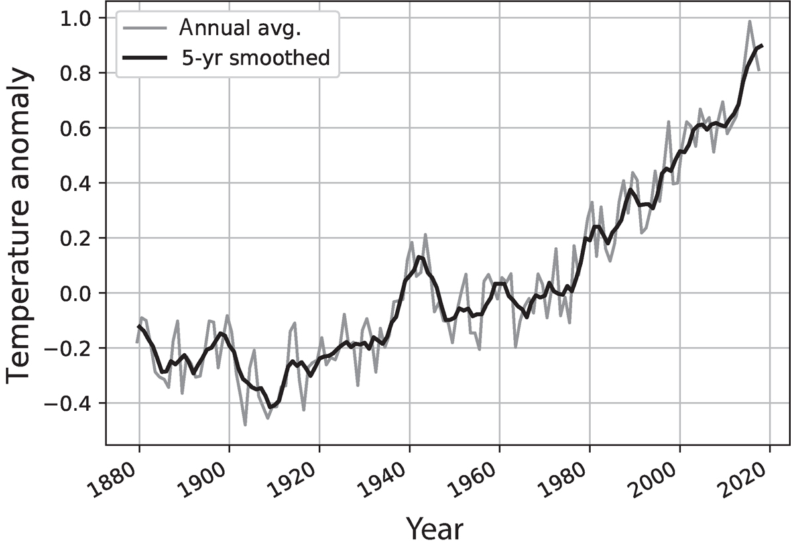

  
```{r setup, include=FALSE}
knitr::opts_chunk$set(warning = FALSE, message = FALSE, 
                      fig.retina = 3, fig.align = "center")
```

```{r xaringanExtra, echo=FALSE}
xaringanExtra::use_webcam()
```

.pull-left[
# An Introduction to Climate Science
<figure>
  
</figure>
]

.pull-right[

</br>
</br>
</br>
**POLI 102: Contemporary Political Issues: _Climate Change_ **

**Summer 2021**

.light[Matthew Nowlin, PhD<br>
Department of Political Science<br>
College of Charleston
]

]

---

class: title title-1

# Climate Change 

_A long-term change in the average weather patterns that have come to define Earth’s local, regional, and global climates. These changes have a broad range of observed effects that are synonymous with the term_ 

--

* "Long-term" = 30 years 
* Climate vs. weather 
* Climate change vs. global warming

---

<figure>
  
</figure>

---

background-image: url(https://media.giphy.com/media/1lwtquKquRLGwFAQVU/giphy.gif)
background-position: 50% 50%
background-size: 80%
class: center, bottom, fullscale

---

class: title title-1

# Climate Science 

**Is the climate changing?**

--

.pull-left[
* The surface thermometer record
* Satellite temperature measurements
* Ice
* Ocean heat content
* Sea level
* Climate proxies 
]

--

.pull-right[
**YES!**
<figure>
  
</figure>
]

---

class: title title-1

# Climate Science 

**Are humans activities responsible?**

--

**Natural processes** 

--

* Tectonic processes 

---

class: title title-1

# Climate Science 

**Are humans activities responsible?**

**Natural processes** 

* ~~Tectonic processes~~ 
* Orbital variations 

---

class: title title-1

# Climate Science 

**Are humans activities responsible?**

**Natural processes** 

* ~~Tectonic processes~~ 
* ~~Orbital variations~~
* Solar variability

---

class: title title-1

# Climate Science 

**Are humans activities responsible?**

**Natural processes** 

* ~~Tectonic processes~~ 
* ~~Orbital variations~~
* ~~Solar variability~~
* Internal variability 

---

class: title title-1

# Climate Science 

**Are humans activities responsible?**

**~~Natural processes~~** 

.pull-left[
* ~~Tectonic processes~~ 
* ~~Orbital variations~~
* ~~Solar variability~~
* ~~Internal variability~~ 
]

--

.pull-right[
**YES!**
<figure>
  
</figure>
]

---

class: title title-1

# Climate Science 

**What further climate changes are likely?** 

--

.pull-left[
**Representative concentration pathways (RCPs)** 

Level of anthropogenic radioactive forcing in watts per square meter (W/m $^2$)

**Current level is 2.3 W/m $^2$**
]

.pull-right[
</br>
<figure>
  
</figure>
]

---

class: title title-1

# Climate Science 

**Contrary (false) claims** 

--

**_Claim 1: Global warming has stopped / is not occurring_** 

--

**_Claim 2: Climate has always changed, so future climate change is nothing to worry about_**

--

**_Claim 3: Climate models predict too much warming; future warming will be much less than predicted_**


