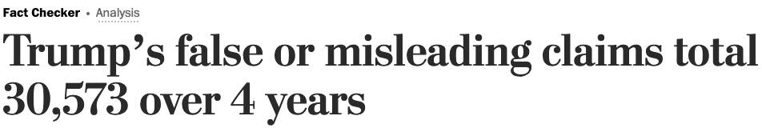

  
```{r setup, include=FALSE}
knitr::opts_chunk$set(warning = FALSE, message = FALSE, 
                      fig.retina = 3, fig.align = "center")
```

```{r xaringanExtra, echo=FALSE}
xaringanExtra::use_webcam()
```

.pull-left[
# Science, Politics, and Policy
<figure>
  
</figure>
]

.pull-right[

</br>
</br>
</br>
**POLI 102: Contemporary Political Issues: _Climate Change_ **

**Summer 2021**

.light[Matthew Nowlin, PhD<br>
Department of Political Science<br>
College of Charleston
]

]

---

class: title title-1

# Justifications for Actions 

--

**Positive statements**: statements about what we know; can _often_ be verified  

_there is currently about 420 parts-per-million of CO2 in the atmosphere_ 

--

**Normative statements**: statements about what we value or should value; should/ought; can't be verified

_Everyone should work to reduce their carbon footprint_ 


---

class: title title-1

# Science 

_advances collective knowledge of the world by proposing and testing **positive claims**_ .small[(DP, pg. 40)]

--

**Scientific method**:
* Generate testable _hypotheses_ 
* Determine what _observable evidence_ is needed 
* Examine evidence to _test hypotheses_ 

--

**Debates are based only on empirical evidence**  

---

class: title title-1

# Politics 

_concerned with collective-action ... what shall we do?_ .small[(DP, pg. 51)]

--

**_not concerned with what is true_**
<figure>
  
</figure>

--

_Politics embraces the processes of argument, negotiation, and struggle over [policy] joint actions or decisions_ .small[(DP, pg. 51)]

--

**Debates are based on normative, positive, and mixed statements** 

---

class: title title-1

# Policy 

**Actions by governments to address problems or issues of social concern** 

--

The policymaking process involves a complex mix of institutions that share policymaking authority 
* Congress: makes legislation 
* Executive: rules and regulations; executive orders 
* Courts: review actions of other branches; issue rulings 

--

**The science and policies associated with climate change is highly politicized**


