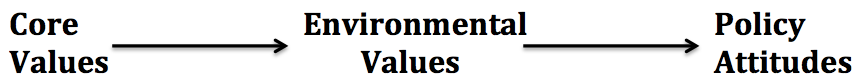

  
```{r setup, include=FALSE}
knitr::opts_chunk$set(warning = FALSE, message = FALSE, 
                      fig.retina = 3, fig.align = "center")
```

```{r xaringanExtra, echo=FALSE}
xaringanExtra::use_webcam()
```

.pull-left[
# Values and Climate Change Polarization
<figure>
  
</figure>
]

.pull-right[

</br>
</br>
</br>
**POLI 102: Contemporary Political Issues: _Climate Change_ **

**Summer 2021**

.light[Matthew Nowlin, PhD<br>
Department of Political Science<br>
College of Charleston
]

]

---

class: title title-1

# Values 

**Values** determine an individual's ideas about right and wrong, and are typically resistant to change
* Inform our identity 
* Guide what we _think_ about political issues 

--

**Value systems are hierarchically structured** 

<figure>
<center>
  
</figure>

---

class: title title-1

# Value Systems 

<figure>
<center>
  
</figure>

__Core values__: 
* Foundational values that span multiple policy domains
  * _Political ideology_, _cultural worldviews_
    
---

class: title title-1

# Value Systems 

<figure>
<center>
  
</figure>


__Environmental values__:
* The appropriate relationship between humanity and nature 
  * _Environmentalism_

---

class: title title-1

# Value Systems 

<figure>
<center>
  
</figure>


__Policy attitudes__:
* Evaluations about particular policy issues
  * _Climate change poses a significant risk_ 
  
---

class: title title-1

# Climate Change Polarization 

**Disagreement about climate change is driven by differences in values and are resistant to change based on positive statements**

--

**Identity based**: 
* I am a Republican 
* Republicans are more skeptical of climate change than Democrats 
* I am skeptical of climate change 

---

class: title title-1

# Climate Change Polarization 

**Disagreement about climate change is driven by differences in values and are resistant to change based on positive statements**

**Solution aversion** 
* Republicans are generally concerned about government regulation of economic activity 
* Addressing climate change involves government regulation as a _solution_ 
* I do not support that solution 
* Climate change is not problem 


