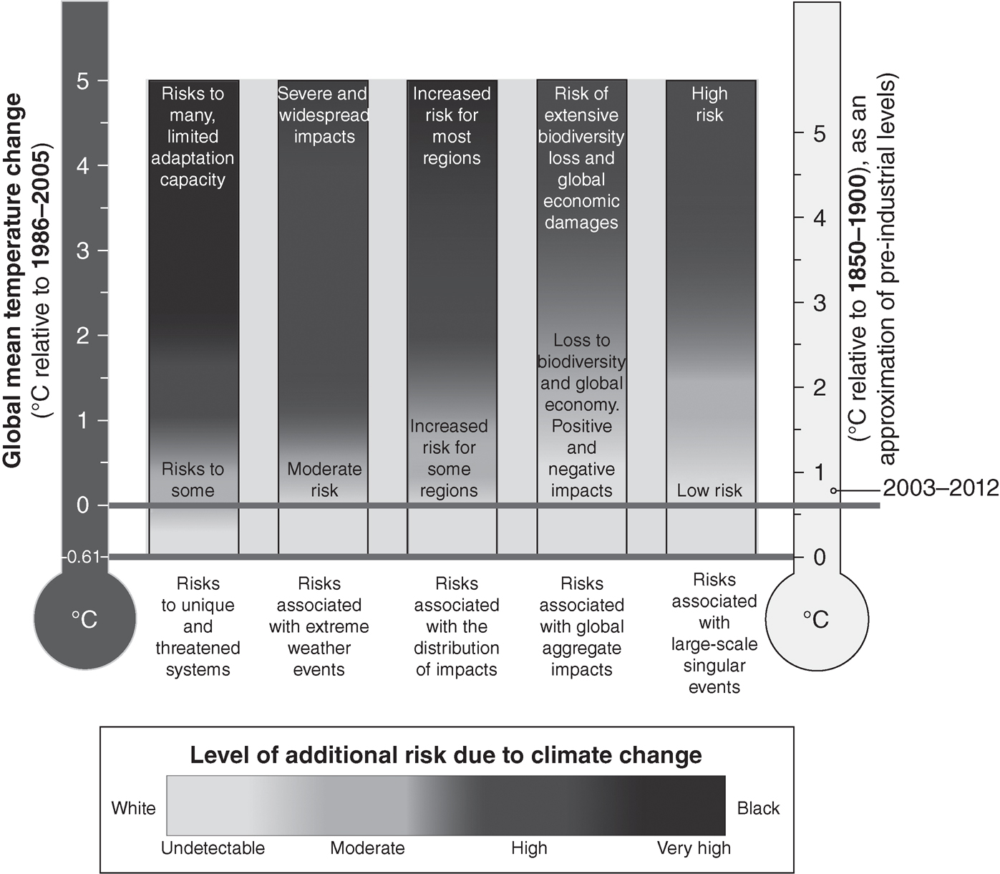
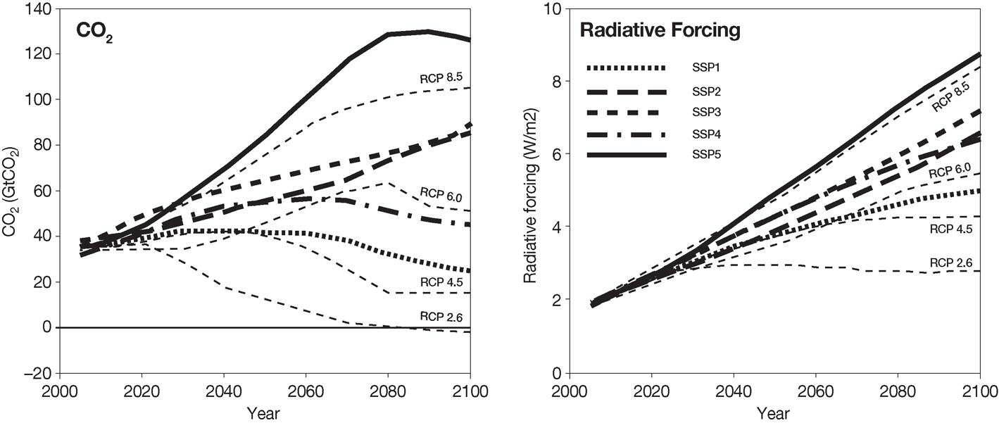
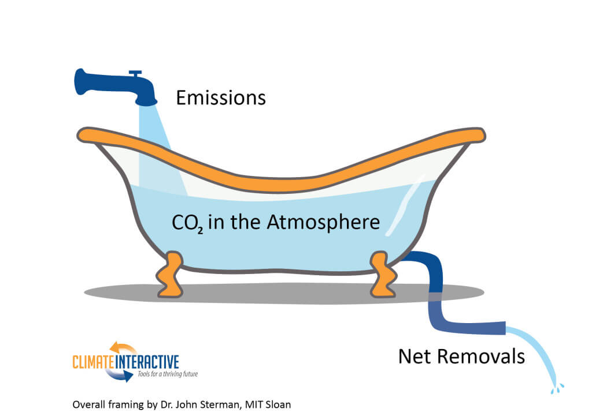

  
```{r setup, include=FALSE}
knitr::opts_chunk$set(warning = FALSE, message = FALSE, 
                      fig.retina = 3, fig.align = "center")
```

```{r xaringanExtra, echo=FALSE}
xaringanExtra::use_webcam()
```

.pull-left[
# Policy Approaches to Climate Change
<figure>
  
</figure>
]

.pull-right[

</br>
</br>
</br>
**POLI 102: Contemporary Political Issues: _Climate Change_ **

**Summer 2021**

.light[Matthew Nowlin, PhD<br>
Department of Political Science<br>
College of Charleston
]

]

---

class: title title-1

# Policy 

**Actions by governments to address problems or issues of social concern** 

The policymaking process involves a complex mix of institutions that share policymaking authority 
* Congress: makes legislation 
* Executive: rules and regulations; executive orders 
* Courts: review actions of other branches; issue rulings 

**The science and policies associated with climate change is highly politicized**

---

class: title title-1

# Climate Impacts 

<figure>
<center>
  
</figure>

---

class: title title-1

# Addressing Climate Change 

**How bad will it be? _Depends on what we do_** 

--

**Two (maybe three) broad approaches** 
* Adaptation 
* Mitigation
* _Geoengineering_?

--

**Need all of the above** 

---

class: title title-1

# Adaptation 

**Targets the effects of climate change** 

--

Species adapt to climate conditions, _but current changes are too large and too fast_  

--

**Policy approaches to enhance adaptation**  
* Provide information: e.g., climate projections, impact studies 
* Regulatory: e.g., zoning
* Direct capacity: e.g., infrastructure (like sea walls)

---

class: title title-1

# Mitigation 

**Targets the causes of climate change** 

--

_Emissions_ = _Population_ **X** _Economic output_ **X** _Technology_ (energy produced and energy consumed) 

--

.pull-left[
**Shared Socioeconomic Pathways (SSPs)**
* Plausible development trajectories
* Matched to RCPs
]

.pull-right[
</br>
<figure>
  
</figure>

]

---

class: title title-1

# Mitigation 

**Targets the causes of climate change** 

**Policy approaches to enhance mitigation** 
.pull-left[
* Market-based 
  * Carbon tax 
  * Cap-and-trade 

* Regulations 
  * EPA and the _Clean Air Act_ 
]

--

.pull-right[
* Public expenditures 
  * Research and development 

* Information, education, and voluntary measures
  * Energy-efficiency labels
]

---

class: title title-1

# Geoengineering 

**Actively modifying the climate system to weaken the link between current emissions and climate change** 

--

.pull-left[
**Carbon removal** 
* Natural carbon sinks
* Carbon capture and storage
* Direct air capture
]

--

.pull-right[
**Solar geoengineering** 
* Reduce the amount of sunlight absorbed at the Earth's surface
]


--

**Policy approaches**: Public expenditures, regulation


---

class: title title-1 

# Putting it All Together 

.pull-left[
**The Bathtub Analogy** 
* Slow the rate of emissions
* Adapt to changing conditions
* Increase the rate of removal 
]


.pull-right[
<figure>
  
</figure>
]


