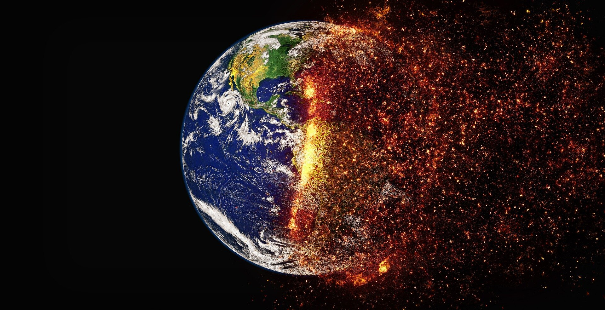

  
```{r setup, include=FALSE}
knitr::opts_chunk$set(warning = FALSE, message = FALSE, 
                      fig.retina = 3, fig.align = "center")
```

```{r xaringanExtra, echo=FALSE}
xaringanExtra::use_webcam()
```

.pull-left[
# Climate Politics and the Road Ahead
<figure>
  
</figure>
]

.pull-right[

</br>
</br>
</br>
**POLI 102: Contemporary Political Issues: _Climate Change_ **

**Summer 2021**

.light[Matthew Nowlin, PhD<br>
Department of Political Science<br>
College of Charleston
]

]

---

class: title title-1

# Current Policies

--

.pull-left[
**International** 
* Paris Agreement 
]

--

.pull-right[
**United States** 
* ~~Climate legislation~~
* EPA regulations 
* Clean Energy Standard 
* Infrastructure
* Federalism (states and cities)
* _Green Vortex_ 
]

---

class: title title-1

# Politics 

**Arguments against action** 

--

* Attack the messengers 

--

* Attack mitigation policy 

--

* Attack international negotiations 

--

* Misuse uncertainty 

---

class: title title-1

# Looking Ahead 

**Strategic principles** 

--

* Strong action is needed, but _not to avoid catastrophe_ 

--

* Requires effective policy

--

* Multiple steps and "perfect" policy is impossible

--

* Climate engineering will likely be on the agenda 

--

* Account for long timescales 


